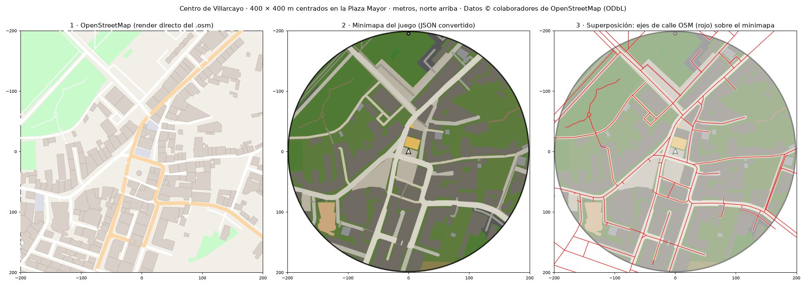
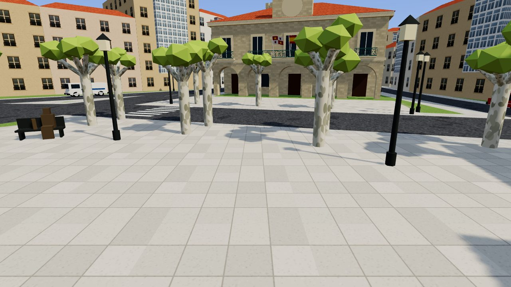
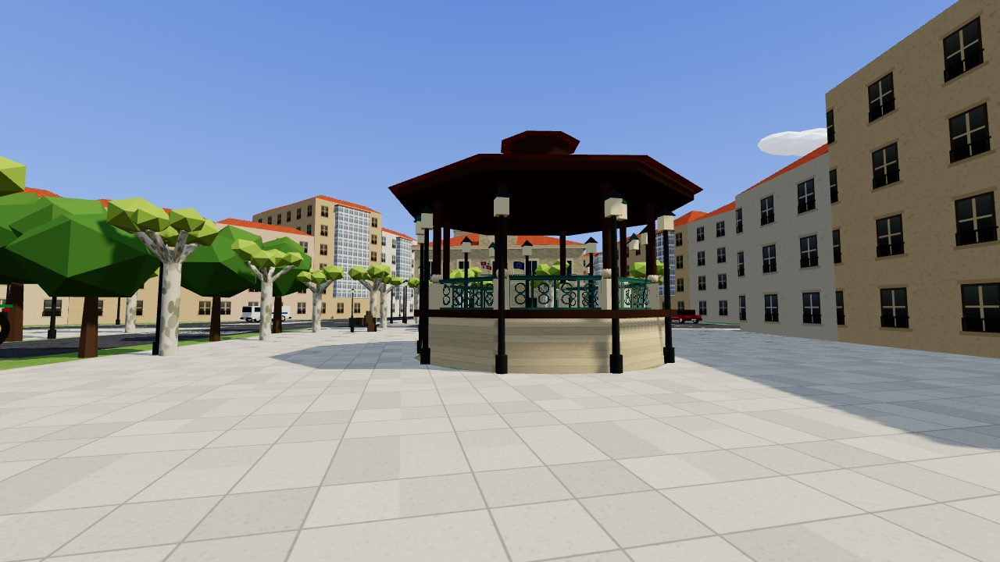

# Villarcayo Sandbox

A browser-based 3D open-world sandbox in the spirit of the early 3D-era *Grand Theft Auto* games, set in **Villarcayo de Merindad de Castilla la Vieja (Burgos, Spain)**. The town is built **from real OpenStreetMap data**: the actual streets, the footprint and height of each of its 1,592 buildings, the course of the Río Nela, parks, trees, street lamps and pedestrian crossings. Built with **TypeScript + Three.js** and bundled with Vite.

```bash
npm install
npm run dev        # http://localhost:5173
npm run build      # typecheck + production bundle in dist/
npm run map        # regenerate src/world/data/villarcayo.json from data/villarcayo.osm
```


## Controls

| Action | Keyboard / mouse | Touch (phones and tablets) |
| --- | --- | --- |
| Walk / drive | **W A S D** / arrows | Joystick (left half of the screen) |
| Run | **Shift** | Push the joystick all the way |
| Jump / handbrake (drift) | **Space** | **SALTAR / FRENO** button |
| Steal / get out of a vehicle | **F** / **E** | **ROBAR / SALIR** button |
| Camera | Mouse (click to lock the pointer) | Drag on the right half of the screen |
| Back to the Plaza Mayor | **R** | |
| Help / mute | **H** / **M** | |

## Where the map comes from

The data pipeline runs in two steps. The browser never parses OSM.

1. **`data/villarcayo.osm`**: an OpenStreetMap export of the bounding box 42.92577–42.95111 N, 3.59137–3.55109 W (≈ 3.3 × 2.8 km).
2. **`scripts/osm-to-map.ts`** (Node, no dependencies) reads the XML, projects coordinates and writes **`src/world/data/villarcayo.json`** (≈ 390 KB). Its processing steps:
   - simplifies geometry (Douglas–Peucker, 0.25–0.5 m)
   - clips everything to the bounds
   - assembles multipolygons (buildings with courtyards, the Plaza Mayor, farmland)
   - infers sidewalks
   - marks road junctions

**Projection.** Equirectangular around the **centroid of the Plaza Mayor** (`place=square`, 42.939036 N, 3.571694 W). +X is east, +Z is south, in metres: `x = (lon − lon0)·cos(lat0)·π/180·R`, `z = −(lat − lat0)·π/180·R`, with R = 6 371 008.8 m. At town scale the distortion is negligible.

### What comes from OSM and what is assumed

| Element | From OSM | Assumed / modelled by hand |
| --- | --- | --- |
| Streets | Course, type, name, `width`/`lanes`, bridges, tunnels (excluded), `sidewalk` tags | Width by type when untagged (primary 7.5 m … footway 2 m); sidewalks inferred on streets lined with buildings |
| Buildings | Real footprint (with courtyards), `building:levels`, `height`, type, material | 3.1 m per storey; 2–3 storeys when untagged (151 buildings); roof shape (hipped on rectangular plots, sloping edges elsewhere); facade colour; galerías on 50 % of old-town houses |
| Río Nela | Centre line, weirs (Presa de Churruca, Presa Danvila), natural pools (`leisure=swimming_area`) | Channel width (16 m) and bed profile; the depth of the pools |
| Parks, fields, forest | Land-use polygons (El Soto, Parque El Soto, farmland, meadows, sports pitches…) | Infill tree density inside forests and parks |
| Trees, lamps, benches, crossings | 481 trees (including tree rows), 740 street lamps, 84 benches, 219 zebra crossings at their real positions | Bench orientation (facing the nearest street); tree species (pollarded plane trees inside the Plaza Mayor, poplars by the river) |
| Ayuntamiento | Footprint and position (`amenity=townhall`) | Façade modelled from the photos: soportales, balcony, clock and bell gable; front turned towards the templete |
| Torre del Corregimiento | Footprint and 4 storeys | Battlements, windows, door |
| Templete, fountain, statue | Position and size (`leisure=bandstand`, `amenity=fountain`, `memorial=bench` "Al músico") | 3D design (octagonal kiosk from the photo) |
| Old railway | Route of the Vía Verde Santander–Mediterráneo, station building "Antigua Estación de Horna-Villarcayo", Mikado locomotive | The locomotive model and the short stretch of track under it |
| Terrain | — | **Flat.** The OSM export carries no elevation, so only the river channel is carved |

## Performance

Measured with `renderer.info` (Chromium, 1280×720) at four viewpoints. "Total" includes the shadow pass.

| View | Desktop: total draw calls / triangles | Desktop: main pass | Mobile (Pixel 7): total | Mobile: main pass |
| --- | --- | --- | --- | --- |
| Plaza Mayor | 136 / 333k | 98 / 231k | 129 / 296k | 95 / 229k |
| Densest street in the centre | 148 / 318k | 113 / 221k | 133 / 264k | 101 / 198k |
| El Soto (river and pools) | 89 / 214k | 65 / 143k | 87 / 238k | 68 / 216k |
| Old station | 89 / 70k | 68 / 60k | 84 / 62k | 63 / 53k |

How the budget is met:

- **Merged static geometry:** the batcher merges geometry per material in 384 m chunks, so distant chunks are culled by the frustum.
- **Vertex colours:** buildings, roofs and every plain-coloured prop share vertex-coloured materials.
- **Road atlas:** asphalt, sidewalk, paving, dirt, gravel and paint share one texture atlas (one draw call per chunk).
- **Instancing:** trees are `InstancedMesh`es; so are the four wheels of each vehicle and the clouds.
- **Merged vehicles and player:** each vehicle and the player are merged into a handful of meshes.
- **Mountains:** they are painted into the sky shader.
- **Draw distance:** 560 m on desktop and 380 m on phones. Phones also get a 1024 px shadow map and no tree shadows.

**Collision** follows the building footprints. Each wall is a thin box collider (18,670 colliders in a spatial hash); the visual geometry is never used for collision.

## Verification

The `.osm` file rendered directly (without the converter), the in-game minimap, and an overlay of the OSM street centre lines on the minimap:



The Plaza Mayor, framed like the reference photos:

| Ayuntamiento | Templete and Ayuntamiento |
| --- | --- |
|  |  |

## Architecture

```
scripts/osm-to-map.ts        OSM XML → projected, simplified JSON
data/villarcayo.osm          OpenStreetMap export (source)
src/
├── main.ts / Game.ts        Renderer, fixed-step (60 Hz) loop on requestAnimationFrame, per-device quality
├── core/                    Input (keyboard, pointer lock, virtual joystick), maths, mergeColoured
├── physics/CollisionWorld   2.5D colliders (rotated boxes and circles with a height range), spatial hash, raycasts
├── entities/                Player, Vehicle (arcade physics with drifting), vehicle models, skid marks
├── camera/FollowCamera      Third-person orbit camera, pulls back and widens the FOV when driving
├── world/
│   ├── data/villarcayo.json Map generated from OSM
│   ├── mapData.ts           Types and loading of the JSON
│   ├── World.ts             Builds everything; heightAt / waterAt / zoneAt (real street names) / roadSpawn
│   ├── Terrain.ts           Heights (river channel, pools, bridge decks), ground mesh and land-use texture
│   ├── Roads.ts             Streets, sidewalks, markings, zebra crossings, bridges; road network index
│   ├── Buildings.ts         Footprint extrusion, roofs, galerías, wall colliders
│   ├── Hydro.ts             Río Nela, pools, streams, swimming pools, weirs
│   ├── Vegetation.ts        Trees (instanced), street lamps and benches at their OSM positions
│   ├── Landmarks.ts         Ayuntamiento, Torre, templete, fountain, "Al músico", bell towers, Mikado
│   ├── Batcher.ts           Merging per material and chunk
│   └── Environment / Materials / textures / geo / geometry / props / Water
├── ui/                      HUD, minimap (vector OSM data), touch controls
└── audio/GameAudio.ts       Synthesised engine and tyre screech
```

`window.__game` exposes the running `Game`, and `game.update(dt)` advances the simulation deterministically (useful for tests).

## Licence and attribution

Map data © [OpenStreetMap contributors](https://www.openstreetmap.org/copyright), available under the Open Database License (ODbL 1.0). The attribution is also shown on the game's start screen.
