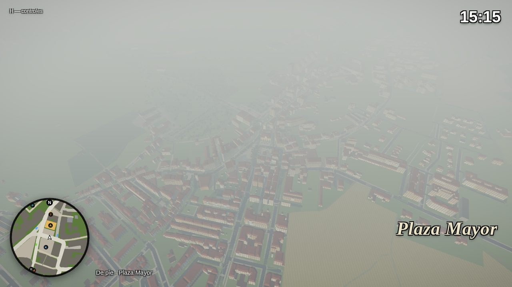

# Villarcayo Sandbox

A browser-based 3D open-world sandbox in the spirit of the early 3D-era *Grand Theft Auto* games, set in **Villarcayo de Merindad de Castilla la Vieja (Burgos, Spain)**. The town is built **from real open data**: OpenStreetMap streets and footprints, the real relief and building heights measured by the **PNOA-LiDAR** point cloud, and the **PNOA orthophoto** on the ground, the roofs and the surrounding hills of Las Merindades. It also includes the course of the Río Nela, parks, trees, street lamps and pedestrian crossings. Built with **TypeScript + Three.js + Rapier** and bundled with Vite.

```bash
npm install
npm run dev        # http://localhost:5173
npm run build      # typecheck + production bundle in dist/
npm run check      # typecheck + Biome lint/format check + unit tests (Vitest)
npm run test:e2e   # real-browser tests (Playwright, after npm run build)
npm run map        # regenerate public/maps/villarcayo.json from data/villarcayo.osm
bash tools/geodata/bake_all.sh   # full geodata bake (OSM + LiDAR + MDT + orthophoto), see below
```



## Controls

| Action | Keyboard / mouse | Touch (phones and tablets) |
| --- | --- | --- |
| Walk / drive | **W A S D** / arrows | Joystick (left half of the screen) |
| Run | **Shift** | Push the joystick all the way |
| Jump / handbrake (drift) | **Space** | **SALTAR / FRENO** button |
| Steal / get out of a vehicle | **F** / **E** | **ROBAR / SALIR** button |
| Camera | Mouse (click to lock the pointer) | Drag on the right half of the screen |
| Back to the Plaza Mayor | **R** | |
| Help / mute | **H** / **M** | |

## Where the map comes from

The data pipeline runs in two steps. The browser never parses OSM.

1. **`data/villarcayo.osm`**: an OpenStreetMap export of the bounding box 42.92577–42.95111 N, 3.59137–3.55109 W (≈ 3.3 × 2.8 km).
2. **`scripts/osm-to-map.ts`** (Node, no dependencies) reads the XML, projects coordinates and writes **`public/maps/villarcayo.json`** (loaded at runtime; ≈ 1.3 MB once the LiDAR measurements and tree crowns are baked in). Its processing steps:
   - simplifies geometry (Douglas–Peucker, 0.25–0.5 m)
   - clips everything to the bounds
   - assembles multipolygons (buildings with courtyards, the Plaza Mayor, farmland)
   - infers sidewalks
   - marks road junctions
   - completes building outlines that their cadastral parts only partly describe (76 outlines, ≈19,000 m² of building that was missing, e.g. Plaza Mayor 10)
   - merges facades split at every party wall, so shop fronts find the real facade
   - applies **`data/corrections.json`**: corrections checked against street-level photos (shop order and names on a facade, railings, direction signs and other furniture OSM does not map). Add entries there to fix a place without touching code

**Projection.** Exact transverse Mercator into **ETRS89 / UTM 30N (EPSG:25830)**, the grid of the Spanish IGN data, with a local origin at E 453 356, N 4 754 203 (the Plaza Mayor): `x = E − 453356` (east), `z = 4754203 − N` (south), in metres. Heights are metres above a datum of 595.94 m (the ground of the plaza), so the OSM, LiDAR, MDT and orthophoto layers line up without any resampling.

3. **`tools/geodata/`** (Python: laspy, numpy, scipy, scikit-image, pillow) bakes the IGN data into the same map. `bake_all.sh` runs every step; the raw downloads stay in `raw/`, which is not committed.
   - `lidar_rasters.py`: the **PNOA-LiDAR 2025** classified point clouds (LAZ, 1 km tiles around the town) → 1 m rasters: bare ground (class 2), surface, building roofs (class 6) and vegetation (class 5).
   - `lidar_walls.py`: the low points (0.35–3.2 m above the ground) on a 0.5 m grid: PNOA files garden walls and fences as low vegetation, so every plot boundary shows up as a thin line.
   - `bake_terrain_buildings.py`:
     - ground model: LiDAR blended over a 25 m feather into the **MDT05** where there is no point cloud → `public/maps/villarcayo.terrain.png` (2 m grid, 16-bit heights in cm stored losslessly in the red and green channels, see `tools/geodata/heightpng.py`)
     - every OSM building measured from its roof points (ground level, eave height, ridge height)
     - buildings that exist in the LiDAR but not in OSM traced from the roof raster (202 added)
     - 10,452 tree crowns detected in the canopy model, with their height and radius
     - Río Nela water levels sampled along the channel, flowing monotonically downstream, with the bed carved under them
     - the ground smoothed along streets and squares (kerbs and gutters in the LiDAR made the ground poke through the asphalt)
     - OSM footprints where the 2025 point cloud only sees bare ground are dropped (demolished)
     - `roofs.py`: one roof per row of buildings that share their eaves (±1 m). The pitch is the median gradient of the LiDAR roof surface, the eaves its low edge, the ridge its 97th percentile and the colour the median of the orthophoto. Shared walls are hidden only when the neighbour really is as tall.
     - `walls.py`: walls, fences and hedges: the OSM barriers plus the thin, straight runs of low points (away from buildings, tree crowns, carriageways and rows of parked cars), cut open wherever a street, lane or path crosses them
     - `hedges.py`: hedges from the LiDAR canopy and low points together with the orthophoto (a long, narrow, even strip 0.7–6 m tall that is dark foliage green in the photo), and the LiDAR walls/fences whose line is foliage green turned into hedges; tall hedges along a street are drawn on a low garden wall
     - `steps.py`: terrace edges, where the LiDAR ground drops ≥ 0.75 m in one step between two flat levels (terraced plots, raised platforms, the river walk); drawn as a retaining wall whose top is flush with the upper level
     - `cars.py`: 1,653 parked cars from the LiDAR (blobs of low points with a car's size and flat top, oriented by their principal axis, rows split into cars)
     - `catastro.py` + `facades.py`: the **Catastro** INSPIRE buildings (year, use, dwellings) and its facade photo of each building → facade style (traditional, stone, mid-century, brick, terraces, modern, civic, industrial, galería) and wall colour; `data/facades.json` holds the manual review of 176 old-town facades from those photos, which wins over the automatic guess
     - `passages.py`: buildings over a passage (`tunnel=building_passage`, e.g. Calle el Soto → Calle Santander) are lifted to the clear height and their ground floor is cut around the corridor
   - `fetch_ortho.py`: **PNOA orthophoto** tiles (WMS) → `public/maps/ortho/{i}_{j}.jpg`, 256 m tiles, draped on the ground (and sampled for the roof colours).
   - `fetch_surroundings.py`: 24 × 24 km of **MDT25** + orthophoto → `public/maps/surroundings.*`, the real valley and hills on the horizon.

### What comes from OSM and what is assumed

| Element | From OSM | Assumed / modelled by hand |
| --- | --- | --- |
| Streets | Course, type, name, `width`/`lanes`, bridges, tunnels (excluded), `sidewalk` tags | Width by type when untagged (primary 7.5 m … footway 2 m); sidewalks inferred on streets lined with buildings |
| Buildings | Real footprint (with courtyards), `building:levels`, `height`, type, material. **3,383 building parts** (`building:part`, from the Spanish cadastre) with their own number of storeys and `building:min_level`, so each building is drawn as its real stepped volume | Heights, eaves, roof pitch, ridge and roof colour are **measured** (LiDAR + orthophoto); 202 buildings missing from OSM traced from the LiDAR. Assumed: the roof form (a hipped roof from the straight skeleton of each row's outline: gables are not distinguished), facade colour and window layout, galerías on half of the old houses of 2–4 storeys |
| Río Nela | Centre line, weirs (Presa de Churruca, Presa Danvila), natural pools (`leisure=swimming_area`) | Channel width (16 m) and bed profile; the depth of the pools |
| Parks, fields, forest | Land-use polygons (El Soto, Parque El Soto, farmland, meadows, sports pitches…) | Infill tree density inside forests and parks |
| Walls, fences, hedges | 108 barriers (walls, fences, hedges, retaining walls; gates leave an opening) and 13 bollards | Plus ~1,800 plot walls and fences (30 km) found in the LiDAR, with their measured height; wall vs fence (masonry plinth + wire mesh) is guessed from the height |
| Trees, lamps, benches, crossings | 481 trees (including tree rows), 740 street lamps, 84 benches, 219 zebra crossings at their real positions | Bench orientation (facing the nearest street); tree species (pollarded plane trees inside the Plaza Mayor, poplars by the river) |
| Ayuntamiento | Footprint and position (`amenity=townhall`) | Façade modelled from the photos: soportales, balcony, clock and bell gable; front turned towards the templete |
| Torre del Corregimiento | Footprint and 4 storeys | Battlements, windows, door |
| Templete, fountain, statue | Position and size (`leisure=bandstand`, `amenity=fountain`, `memorial=bench` "Al músico") | 3D design (octagonal kiosk from the photo) |
| Old railway | Route of the Vía Verde Santander–Mediterráneo, station building "Antigua Estación de Horna-Villarcayo", Mikado locomotive | The locomotive model and the short stretch of track under it |
| Shops, bars and services | **224 establishments** (`shop`, `amenity` bar/pub/restaurant/café/bank/pharmacy/post office/police…, `office`, `craft`, `healthcare`, hotels, including closed ones such as Bar Capitol) with their real name, on the ground-floor wall of **their own building** facing the street of their `addr:street` (110 of 127 shops with an address face that street; the rest are in buildings that do not touch it) | Shop front by trade (shop window, door or roller shutter, awning, terrace), sign colours (brand colours for banks and chains, otherwise by trade) |
| Churches | Footprints and positions of Santa Marina, its campanile (`tower:type=bell_tower`), the Ermita de San Roque and the Ermita de San Vicente | Santa Marina from photos and the LiDAR: A-frame "tent" roof falling from 19.5 m over the front to ~9 m over the apse, front gable as a concrete lattice of oval stained glass, flat porch on paired pillars over a stone base with steps, white needle campanile with its cross; stone hermitages with espadaña |
| Sports | 29 pitches with their sport: football (Campo El Soto, Campo Genín), futsal, basketball, tennis, pádel, frontones, Bolera Nela, petanque, table tennis; Polideportivo; sports-ground fences | Court markings, goals, hoops, nets, frontón walls, the nine bolos; the polideportivo's vaulted roof |
| Parkings, fuel, buses | 37 car parks (with `orientation`), Estación de Servicio Rivera, Estación de Autobuses, bus stops | Bay layout and parked cars; canopy, pumps and totem; bus shelters |
| Street furniture | ~900 items: S-13 pedestrian-crossing signs on both kerbs of every zebra, stop and give-way signs (on the right kerb, facing the traffic they control), recycling containers by stream, bins, planters, fountains, hydrants, info boards, cameras, cabinets, post boxes, AED, chargers, billboards and the municipal digital screen (high on its mast at the tip of the Plaza Mayor), kiosks (Prensa y Revistas, ONCE), the flagpole, statues ("Pasos"), kilometre posts (BU-561 km 0); 40 power lines. From photos: the direction signs (Bilbao, Laredo, Ojo Guareña, Santelices, Burgos), R-303, P-15a and the railing at the plaza tip | Models; sign posts placed on the kerb |
| Picnic, playgrounds, pines | 7 picnic tables + picnic sites (riverside tables in El Soto), 13 playgrounds, conifers (`leaf_type=needleleaved`) | Extra tables around each picnic site; swings and slide; hedges on field boundaries; field patchwork where OSM has no land use |
| Terrain and heights | — (from the **PNOA-LiDAR** and **MDT05/MDT25**) | Real relief at 2 m; building walls up to the measured eave and roofs up to the measured ridge; river levels and bed depth from the LiDAR ground. Façades are still stylised (no open data on façade colour or window layout); the orthophoto on roofs has some relief displacement; the NW LiDAR tile is missing, so that corner uses the 5 m MDT |

## Menu and arrival

`index.html` + `src/ui/MainMenu.ts`: the main menu over the live town (a crane shot round the Plaza Mayor at dusk), logo and list as in the design mockups: **Entrar al mundo**, **Ajustes** (volumes per channel, mouse, length of the day, weather and hour when entering), **Créditos**, and a hidden slot for a future login. The first click unlocks the browser's audio. `src/ui/ArrivalSequence.ts` runs the way in: fade to black (1 s, menu music down) → player placed in the dark → fade in from black, blurred to sharp (2 s) → the camera descends from high above to behind the player (3.6 s) → control → HUD fades in half a second later. `game.begin()` skips all of it (tests).

## Sound files (placeholders)

`public/config/audio.json` lists every recorded sound the game plays through Howler.js, with placeholder paths under `public/assets/audio/` (menu music; ambient zones for the Plaza Mayor, the Río Nela, the bar street and the outskirts, each with loop, night loop, music layer and stingers; rain, wind and thunder; pedestrians' reaction lines). Drop the files at those paths (or change the paths): a missing file plays as silence. Zones are data: circle, river distance or outskirts, priority and crossfade time. Volumes per channel are in Ajustes.

## Climate

`src/world/Climate.ts` (`__game.climate`): time of day (a day in 24 real minutes by default) and weather (despejado, nublado, lluvia, lluvia fuerte, niebla) with smooth transitions, changing by itself; wet ground, lightning, fog; street lamps and windows light up at night or under a dark sky. Debug: **T** one hour on, **Y** next weather, `__game.climate.setTime(21.5)`, `__game.climate.setWeather('niebla')`, or `?hora=21&clima=lluvia` in the URL. Rain drops are a hook for now (`RainFX.particles`): the realistic rain will plug in there.

## Life in town

- **Car radio (GTA IV style)**: on when you get into a vehicle; the station's logo and name show at the top centre (click it, use the ‹ › buttons, **Q / Z** or the mouse wheel to change). National stations play their live streams (Los 40, Cadena SER, COPE, Onda Cero, Kiss FM, Rock FM, Cadena Dial, Europa FM, RNE; HLS through hls.js, loaded on demand); Radio Merindades, Nela FM and Corregimiento Rock are made up and their music is generated live. The last station is remembered. Logos are original monochrome plates; to use official artwork, put `public/radio/<id>.svg` and list the id in `public/radio/logos.json` (shown in greyscale).
- **Day and night**: the clock starts at your local time and runs a day in 24 minutes (**T** skips an hour). The sun follows Villarcayo's path (rise ~7:30, set ~20:30), with golden and blue hours, stars and moonlit shadows; street lamps glow and light the street around you, a share of windows light up, headlights come on.
- **Footsteps** sound different on asphalt, paving, grass, gravel and water.
- **Pedestrians** (`src/entities/PedestrianSystem.ts`, `PedestrianAI.ts`): a population of townspeople in the busy places (more near shops and the plaza), simulated near the camera, drawn with a pool of re-coloured bodies. They walk, stop, look at their phone, sit on the real benches, jump aside from a fast car, fly when hit (ragdoll) and get up angry; `__game.pedestrians.panicAt(x, z, r)` sends them running for shelter. Voice lines are hooks to the files in audio.json.
- **Parked cars** (from the LiDAR) can be shoved by a driven car; **signs, lamp posts and bollards** fall over when hit.

## Driving physics

- **Grip depends on the surface** under the car:
  - asphalt;
  - pavement;
  - gravel;
  - grass;
  - water.
- **The wet loses about a third of the grip.** Rain wets the road through `world.wetness`.
- **Grip limits the car:**
  - the engine cannot push harder than the tyres hold;
  - braking scales with grip;
  - the tail slides out more easily under hard acceleration while steering (weight transfer).
- **Speed is also shaped by** air drag and gravity along the slope.
- **Reference figures** (sedan): 0–50 km/h in about 1.8 s; braking from 50 to 0 in about 8 m dry and 10 m wet.
  - Measure them with `node tools/qa/drive.cjs` against `vite preview`.

## Visual checks and autonomous work

- `tools/qa/look.cjs` takes screenshots from fixed viewpoints at any hour and weather.
- `.claude/skills/villarcayo-autopilot/SKILL.md` is the working loop for continuing the project unattended:
  - the rules (real data only, attribution, rain left for later);
  - the backlog;
  - the mistakes not to repeat.

## Graphics and quality levels

The look is inspired by modern open-world games (warm low sun, hazy distance, wind in the grass), within what a browser can do:

- **PBR materials** (`MeshStandardMaterial`) lit by an environment map baked from the sky. Facades, stone, tiles and paving have normal maps generated from their textures.
- **Facade atlas.** Upper storeys show stone-framed windows with wooden shutters and iron rails. The ground floor alternates doorways and barred windows over a sandstone plinth.
- **Physically based sky** (Preetham scattering with procedural clouds) and a ring of hazy mountains in a separate background pass with its own far plane. The mountains are a backdrop; the OSM data has no elevation.
- **Grass.** Wind-blown tufts around the camera in one draw call. A density mask keeps them off roads, buildings, paving and water, and fields turn golden.
- **Trees.** Crowns are made of alpha-tested leaf cards with volume-like normals and wind sway, and their shadows respect the leaf cut-outs.
- **Water.** It shows Fresnel sky reflection, sun glint, waves flowing downstream, colour and transparency from the real channel depth, foam at the edges, and boulders along the banks.
- **Post-processing** (desktop only): multisampled HDR, subtle bloom, ACES tone mapping and a warm cinematic grade with vignette.

| | Desktop (high) | Phones and tablets |
| --- | --- | --- |
| Post-processing | MSAA ×4, bloom, colour grade | No (direct render with tone mapping) |
| Shadow map | 4096 px, trees cast shadows | 1024 px, no tree shadows |
| Grass | 40 m radius, 0.5 m spacing | 24 m radius, 0.9 m spacing |
| Trees (of the 10,452 LiDAR crowns) | about 8,400 | about 3,600 (lighter crowns) |
| Parked cars | about 2 of 3 bays taken | about 1 of 2 bays taken |
| Haze / draw distance | 620 m | 380 m |
| Pixel ratio | up to 1.5 | up to 1.25 |

## Performance

Measured with `renderer.info` (Chromium, 1280×720 desktop; Pixel 7 emulation), counting every pass of a frame. "Shadows" is the shadow-map pass.

| View | Desktop: draw calls (total) | Desktop: triangles (main / shadows) | Mobile: draw calls (total) | Mobile: triangles (main / shadows) |
| --- | --- | --- | --- | --- |
| Plaza Mayor | 229 | 892k / 220k | 185 | 397k / 141k |
| Densest street in the centre | 233 | 852k / 160k | 185 | 399k / 106k |
| El Soto (river and pools) | 172 | 735k / 156k | 132 | 298k / 47k |
| Old station | 159 | 598k / 43k | 113 | 189k / 21k |

The real relief costs geometry: the orthophoto ground, the 10,000 LiDAR tree crowns, the 30 km of walls and fences, the kerbs and the MDT25 landscape on the horizon. The mobile main pass goes over the 300k-triangle budget in the two densest views (about 400k) while staying under 160 draw calls. The biggest items there are the merged props (parked cars, lamps, furniture: about 120k), the roads and the trees; they are the first candidates for LODs in the graphics phase. The desktop "high" level spends more on grass, trees and shadows and is meant for a desktop GPU. The figures were measured in a software renderer; frame rates have to be checked on real hardware.

## Architecture

The game is split so that gameplay never depends on a concrete engine or on hard-coded data:

- **Data, not code:** tuning lives in `public/config/*.json`, validated at boot. A typo or an out-of-range value fails with its exact path. The map lives in `public/maps/` and is loaded at runtime.
- **Physics behind an interface:** gameplay talks to `PhysicsWorld`, and the Rapier backend implements it. Swapping the backend, or porting to Godot or Unity physics, does not touch gameplay.
- **Systems, not a god object:** `Game` is only the composition root. Gameplay rules live in `systems/` and communicate through a typed `EventBus`.
- **Input as actions:** gameplay reads named actions (`use`, `jump`…). Keys and touch buttons are bindings in `input.json`.

```
public/
├── config/                  game.json · vehicles.json · quality.json · input.json (runtime data)
└── maps/                    villarcayo.json (OSM + LiDAR measurements), villarcayo.terrain.png (heightmap),
                             ortho/ (orthophoto tiles), surroundings.heights.png/.jpg (MDT25 horizon), fetched at boot
tools/geodata/               Python bake of the IGN data (LiDAR, MDT, orthophoto) into public/maps
src/
├── main.ts                  Boot: loads config + map + Rapier, then builds the Game
├── Game.ts                  Composition root: renderer, world, entities, systems, frame loop
├── config/                  Config schema (validated) and loader
├── core/                    FixedStepLoop, EventBus + GameEvents, validation helpers, maths
├── input/                   RawInput (keyboard, pointer lock, virtual keys) → InputActions
├── physics/                 PhysicsWorld interface (layers, characters, vehicles, queries) + RapierPhysics
├── systems/                 Locomotion (fixed-step movement), VehicleInteraction (steal / get out)
├── entities/                Player, Vehicle (arcade handling with drifting), vehicle models, skid marks
├── camera/FollowCamera      Third-person orbit camera, pulls back and widens the FOV when driving
├── world/
│   ├── mapData.ts           Map types, validation and runtime loading
│   ├── World.ts             Builds everything; heightAt / heightGrid / waterAt / zoneAt / roadSpawn
│   ├── Terrain.ts           TerrainModel (heightmap sampling, bridge decks, river levels), orthophoto tiles, ground mesh
│   ├── Roads.ts             Streets, sidewalks with kerbs (clipped at junctions), markings, zebra crossings, bridges
│   ├── Buildings.ts         Footprint extrusion up to the eaves, galerías, wall colliders
│   ├── Roofs.ts             Shared roofs: straight-skeleton hip roofs with the measured pitch, ridge and colour
│   ├── Barriers.ts          Walls, fences, hedges and bollards that follow the ground, with colliders
│   ├── Hydro.ts             Río Nela, pools, streams, swimming pools, weirs
│   ├── Vegetation.ts        Leaf-card trees (instanced, wind), street lamps and benches at their OSM positions
│   ├── Grass.ts             Wind-blown grass around the camera with an OSM-derived density mask
│   ├── Landmarks.ts         Ayuntamiento, Torre, templete, fountain, "Al músico", bell towers, Mikado
│   ├── Churches.ts          Santa Marina (tent church + campanile), Ermitas de San Roque and San Vicente
│   ├── Commerce.ts          Shop fronts and signs with the real names (one sign atlas), terraces
│   ├── StreetFurniture.ts   Traffic signs, containers, bins, posts, power lines with sagging wires
│   ├── Screens.ts           Digital screens: a programme of slides (clock, live feed, shops, stats), extendable
│   ├── Facilities.ts        Polideportivo, petrol station, bus station, car parks with parked cars, fences
│   ├── Sports.ts            Courts and pitches by sport, picnic tables, playgrounds
│   ├── Batcher.ts           Merging per material and chunk
│   └── Environment (sky, IBL, sun, mountains) / Materials (PBR) / textures / geo / geometry / props / Water
├── render/Pipeline.ts       Background (sky + mountains) and town passes; HDR composer with bloom and grade
├── ui/                      HUD, minimap (vector map data), touch controls
└── audio/GameAudio.ts       Synthesised engine and tyre screech
tests/
├── unit/                    Vitest: geometry, maths, config validation, map file, loop/events, Rapier backend, terrain, roofs, sidewalks
└── e2e/                     Playwright: boot + drive, player physics (walls, jump, swim), vehicle crashes
```

`window.__game` exposes the running `Game`, and `game.update(dt)` advances the simulation deterministically (used by the e2e tests).

**Digital screens.** The animated billboards of the map (the municipal screen in the Plaza Mayor) run a programme of slides. A slide is `{ name, seconds, live?, draw(g, info) }` drawn on a 512 × 288 2D canvas (`info` has the time, date, zone, speed, top speed, distance and shops); `live: true` shows the camera feed of the player under it. Add one from code or the console:

```js
__game.world.screens.add({ name: 'fiestas', seconds: 8, draw: (g) => { g.fillStyle = '#c0392b'; g.fillRect(0, 0, 512, 288); g.fillStyle = '#fff'; g.font = 'bold 36px sans-serif'; g.fillText('Fiestas de Santa Marina', 40, 150); } });
```

## Licence and attribution

Map data © [OpenStreetMap contributors](https://www.openstreetmap.org/copyright), available under the Open Database License (ODbL 1.0).

Elevation, LiDAR and orthophoto: PNOA-LiDAR 2025, MDT05, MDT25 and PNOA orthophoto © [Instituto Geográfico Nacional](https://www.ign.es) (CNIG), with the Junta de Castilla y León for the LiDAR, under CC BY 4.0 ([scne.es](https://www.scne.es)).

Buildings (year, use, facade photos): © [Dirección General del Catastro](https://www.catastro.hacienda.gob.es), INSPIRE Buildings, under CC BY 4.0.

These attributions are also shown on the game's start screen.
